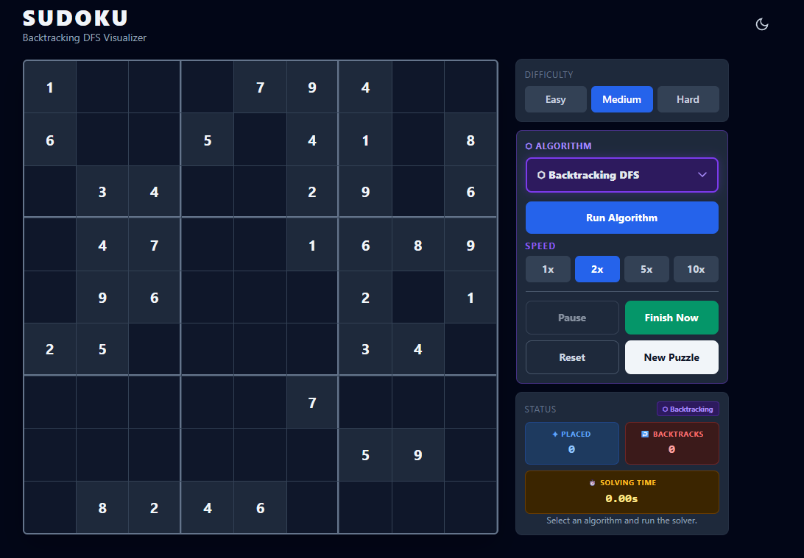

# Sudoku Solver Visualizer

A browser-based visualizer for Sudoku backtracking. The app generates a valid Easy, Medium, or Hard Sudoku puzzle, shows the unsolved layout, and then animates how a depth-first backtracking solver places values, hits dead ends, and backtracks.

This project is a static web app deployed from the repository root. It has no backend, no bundler, and no build output directory.

## Live Project

[Open the live Sudoku Solver Visualizer](https://sudoku.tomnguyen.me/)

To keep this GitHub README open, use `Ctrl`+click on Windows/Linux, `Cmd`+click on macOS, or right-click the link and choose `Open link in new tab`.

## Project Image



## What It Does

- Generates fresh Sudoku layouts for Easy, Medium, and Hard.
- Verifies generated layouts are valid, solvable, and unique before display.
- Keeps the current puzzle fixed until the user changes difficulty or clicks `New Puzzle`.
- Animates a backtracking trace with placement and backtracking highlights.
- Tracks placed values, backtracks, and selected-speed solving time.
- Supports pause, resume, reset, immediate completion, speed selection, and dark mode.
- Works as a static Netlify site and includes PWA metadata plus a cache-first service worker.

## Try It Locally

Install dependencies once:

```bash
npm install
```

Start any static file server from the repository root:

```bash
python -m http.server 4173 --bind 127.0.0.1
```

Then open:

```text
http://127.0.0.1:4173/index.html
```

The app can also be opened from an existing local static server. Avoid opening `index.html` directly from the filesystem when checking PWA/service-worker behavior.

## User Flow

1. Choose `Easy`, `Medium`, or `Hard`.
2. Review the generated starting layout.
3. Choose the algorithm. Currently the app supports `Backtracking DFS`.
4. Choose playback speed: `1x`, `2x`, `5x`, or `10x`.
5. Click `Run Algorithm` to animate the trace.
6. Use `Pause`, `Finish Now`, `Reset`, or `New Puzzle` as needed.

`Reset` restores the same generated puzzle to its original unsolved layout. `New Puzzle` generates a fresh layout for the selected difficulty.

## Controls

| Control | Behavior |
|---|---|
| Difficulty | Generates a new puzzle when changed. |
| Algorithm | Selects the visualized solving algorithm. Only Backtracking DFS exists today. |
| Run Algorithm | Builds and replays the backtracking trace for the current puzzle. |
| Speed | Changes playback delay for the visualizer. |
| Pause | Freezes animation and solving time. |
| Finish Now | Skips the remaining wait while adding the projected selected-speed trace duration, fills the solved board, and marks the puzzle solved. |
| Reset | Clears solver-added values and returns to the current generated layout. |
| New Puzzle | Generates a fresh puzzle at the current difficulty. |
| Theme toggle | Toggles dark mode and persists the preference in `localStorage`. |

## Visual Design

The page is a solver visualizer, not a manual Sudoku game. There is no number pad, hint system, mistake counter, score, leaderboard, or game-over flow.

The desktop layout places the board next to a control/status column. The board grows at the large-screen breakpoint so its square height lines up with the full control column. In stacked browser widths, the puzzle and controls left-align with the title. On mobile, the board uses height-aware sizing and the controls compress so the full puzzle, controls, and status notification fit in one viewport on common phone sizes.

Dark mode is implemented by toggling the `dark` class on `<html>`.

## Difficulty Model

Difficulty is defined by the number of empty cells:

| Difficulty | Empty cells |
|---|---:|
| Easy | 36 |
| Medium | 46 |
| Hard | 52 |

Generation starts from a complete solved board, shuffles it, removes clues, and accepts only layouts with exactly one solution.

## Solver Model

The visualized algorithm is ordinary recursive backtracking:

1. Find the next empty cell.
2. Try candidate numbers from 1 to 9.
3. Place a candidate if it is valid in the row, column, and 3x3 box.
4. Continue recursively.
5. If no candidate works later, clear the cell and backtrack.

The UI does not solve live one DOM mutation at a time. It first creates a deterministic trace, then replays that trace at the selected speed. This keeps pause, reset, finish-now, and testing behavior predictable.

## Tech Stack

| Layer | Choice |
|---|---|
| Markup | `index.html` |
| Styling | Local Tailwind browser runtime plus custom `style.css` |
| Reactivity | Local Alpine.js |
| Solver/generator logic | Vanilla JavaScript modules in `src/` |
| Tests | Node `assert` tests and Playwright browser smoke test |
| Deployment | Netlify static site |
| PWA | `manifest.json`, icons, and `sw.js` |

All runtime libraries are vendored in `vendor/` so the app does not depend on CDN availability.

## Project Structure

```text
index.html                 - page markup, Alpine root, script/style loading, PWA tags
style.css                  - board grid, visual states, responsive layout, mobile controls
src/solver.js              - validation, solvePuzzle, countSolutions, trace creation
src/generator.js           - solution generation, board shuffling, clue removal
src/visualizer.js          - Alpine state, playback controls, timers, UI helpers
game.js                    - CommonJS compatibility export for Node tests
vendor/                    - local Tailwind and Alpine runtime files
manifest.json              - PWA manifest
sw.js                      - cache-first service worker asset list
icons/                     - PWA icons
tests/game.test.js         - solver, generator, and visualizer behavior tests
tests/project.test.js      - setup, docs, and asset guardrail tests
tests/smoke.test.js        - Playwright browser workflow smoke test
docs/release-checklist.md  - deployment checklist
implementation-notes.md    - running log of decisions and tradeoffs
```

## Development

Run the logic and setup tests:

```bash
npm test
```

Run the browser smoke test:

```bash
npm run test:smoke
```

Run everything before pushing or deploying:

```bash
npm test && npm run test:smoke
```

## PWA Cache Notes

The service worker uses a cache-first strategy for static runtime assets. When changing files listed in `sw.js`, update both:

- the `CACHE` version in `sw.js`
- the matching `?v=` query strings in `index.html`

The page listens for `controllerchange` and reloads automatically when a new service worker takes over, so deployed updates do not require users to hard-refresh.

## Deployment

Connect the GitHub repository to Netlify.

- Build command: none
- Publish directory: repository root
- Entry point: `index.html`

Before deployment, follow [docs/release-checklist.md](docs/release-checklist.md).

## Documentation

- Project guide: [CLAUDE.md](CLAUDE.md)
- Implementation notes: [implementation-notes.md](implementation-notes.md)
- Original design spec: [docs/superpowers/specs/2026-05-23-sudoku-game-design.md](docs/superpowers/specs/2026-05-23-sudoku-game-design.md)

## Out Of Scope

Manual Sudoku play, hints, pencil notes, score tracking, leaderboards, user accounts, native mobile packaging, and backend persistence are intentionally outside the current project scope.
